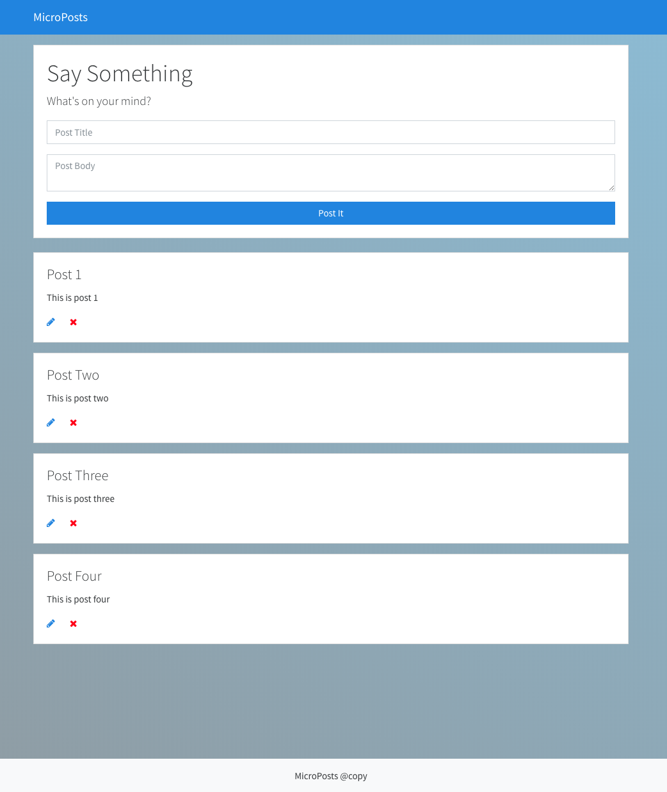
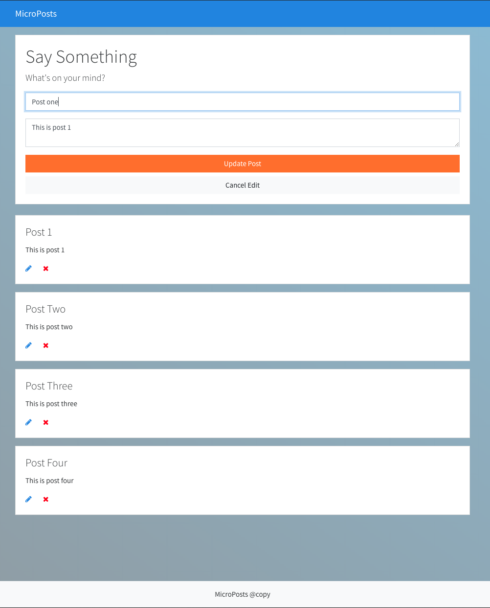

# Microposts App

A Javascript CRUD POSTS App using ES6 Modules and Json Server for the REST API. Code is transpiled using Webpack and Babel

### Version
1.1.0

## Usage

### Installation

Install the dependencies

```sh
$ npm install
```

### Serve
To serve in the browser  - Runs webpack-dev-server

```sh
$ npm start
```

### JSON Server
To run a fake JSON REST API server run the below commnad and visit http://localhost:3000/posts
```sh
npm install json-server --save
```

### Build
Compile and build

```sh
$ npm run build
```

## More Info

### Functionality
- Add a post with title and body
- Delete post with message confirmation
- Update post with the ability to cancel and confirmation message

### Screenshots




### License

This project is licensed under the MIT License